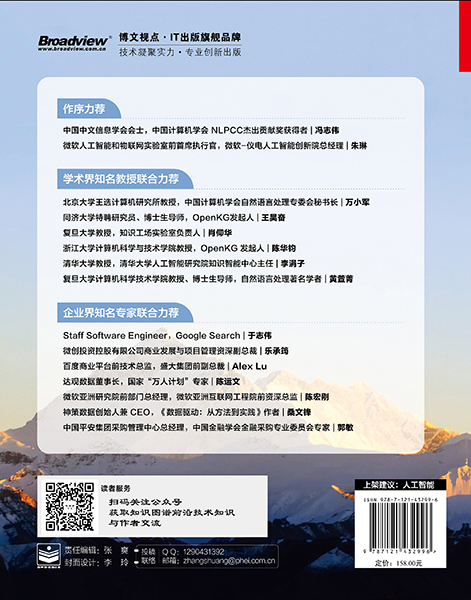

# CCKS 2020 Baseline: 基于本体的金融知识图谱自动化构建技术评测的指引

## 竞赛主页

https://www.biendata.com/competition/ccks_2020_5/

## docker

提供一个打好的镜像可直接运行，见：

https://hub.docker.com/repository/docker/wgwang/ccks2020-baseline/general

## 竞赛数据集

竞赛的数据集已经在 SciDB 和 OpenKG 上公开发布，详情见：

[**中文领域最大规模的金融研报知识图谱数据集FR2KG**](https://mp.weixin.qq.com/s/cgQq27rmU_8LqM1t07A6Pg)

## 参考书籍

《[**知识图谱：认知智能理论与实战**](https://item.jd.com/13172503.html)》一书是绝佳的参考教材：
- 一百多张精美配图详细解析数十个知识图谱前沿算法
- 首创知识图谱建模方法论——六韬法及模式设计工程模型
- 全面涵盖知识图谱模式设计、构建、存储和应用技术
- 前沿理论研究成果和产业落地实践相结合，学术界和企业界顶尖专家学者联合力荐
- 全彩印刷，书籍质量一流，看起来赏心悦目
- 促进知识图谱落地应用，推动人工智能向认知智能蓬勃发展
- 学术界：
  - 中国中文信息学会会士，中国计算机学会 NLPCC杰出贡献奖获得者冯志伟作序
  - 北京大学万小军教授、同济大学王昊奋研究员、清华大学李涓子教授、复旦大学肖仰华教授、浙江大学陈华钧教授、复旦大学黄萱菁教授共同倾力推荐
- 产业界：
  - 微软-仪电人工智能创新院总经理朱琳女士作序
  - Google知识图谱团队于志伟先生、微创医疗集团乐承筠博士、盛大Alex Lu先生、达观数据陈运文博士、微软陈宏刚博士、中国平安郭敏先生、神策数据桑文锋先生共同力荐
  

 

## 竞赛背景

金融研报是各类金融研究结构对宏观经济、金融、行业、产业链以及公司的研究报告。报告通常是有专业人员撰写，对宏观、行业和公司的数据信息搜集全面、研究深入，质量高，内容可靠。报告内容往往包含产业、经济、金融、政策、社会等多领域的数据与知识，是构建行业知识图谱非常关键的数据来源。另一方面，由于研报本身所容纳的数据与知识涉及面广泛，专业知识众多，不同的研究结构和专业认识对相同的内容的表达方式也会略有差异。这些特点导致了从研报自动化构建知识图谱困难重重，解决这些问题则能够极大促进自动化构建知识图谱方面的技术进步。

本评测任务参考 TAC KBP 中的 Cold Start 评测任务的方案，围绕金融研报知识图谱的自动化图谱构建所展开。评测从预定义图谱模式（Schema）和少量的种子知识图谱开始，从非结构化的文本数据中构建知识图谱。其中图谱模式包括 10 种实体类型，如机构、产品、业务、风险等；19 个实体间的关系，如(机构，生产销售，产品)、(机构，投资，机构)等；以及若干实体类型带有属性，如（机构，英文名）、（研报，评级）等。在给定图谱模式和种子知识图谱的条件下，评测内容为自动地从研报文本中抽取出符合图谱模式的实体、关系和属性值，实现金融知识图谱的自动化构建。所构建的图谱在大金融行业、监管部门、政府、行业研究机构和行业公司等应用非常广泛，如风险监测、智能投研、智能监管、智能风控等，具有巨大的学术价值和产业价值。

评测本身不限制各参赛队伍使用的模型、算法和技术。希望各参赛队伍发挥聪明才智，构建各类无监督、弱监督、远程监督、半监督等系统，迭代的实现知识图谱的自动化构建，共同促进知识图谱技术的进步。

## 竞赛任务

本评测任务参考 TAC KBP 中的 Cold Start 评测任务的方案，围绕金融研报知识图谱的自动化图谱构建所展开。评测从预定义图谱模式（Schema）和少量的种子知识图谱开始，从非结构化的文本数据中构建知识图谱。评测本身不限制各参赛队伍使用的模型、算法和技术。希望各参赛队伍发挥聪明才智，构建各类无监督、弱监督、远程监督、半监督等系统，迭代的实现知识图谱的自动化构建，共同促进知识图谱技术的进步。

## 联系

达观数据 wangwenguang@datagrand.com

## 参与

- 关于baseline的任何问题可以使用issue进行交流，有任何改进的想法可以使用pr参与
- 有竞赛、数据集和书籍有关的问题、想法，欢迎扫描下面二维码关注“走向未来”公众号留言
    

